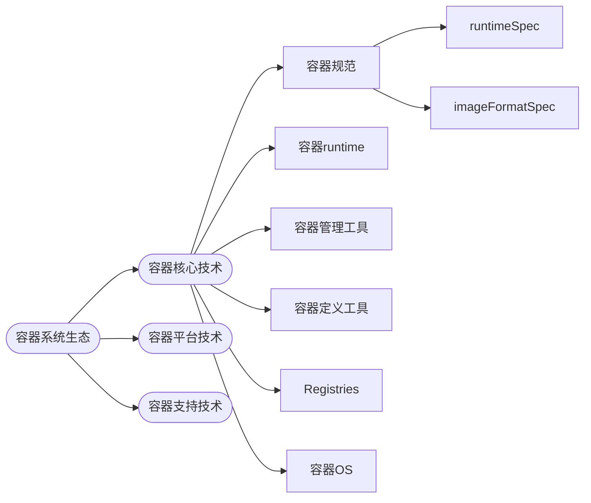
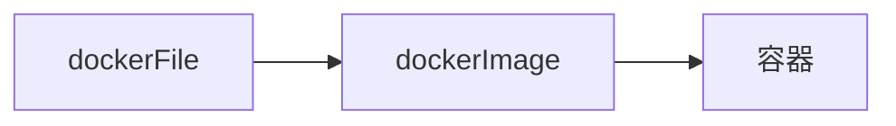
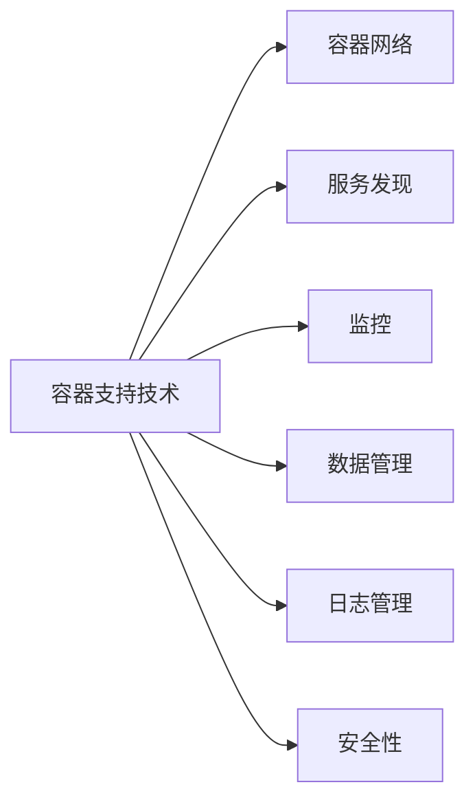

# 
Docker

## 容器生态系统：

**Open Container Initiative(OCI)组织发布的规范：**
- runtime　 Spec
- image format spec
  

**当前主流的三款容器runtime：**
- Lxc---linux老牌的容器runtime
- runc--Docker自己开发的容器runtime（符合OCI规范）
- rkt--CoreOS开发的容器runtime（符合OCI规范）

|容器产家|runtime|管理工具|容器定义工具|Registries-仓库|容器OS|
|----|----|----|----|-----|----|
|Linux|lxc|lxd| docker image|Docker Registry | |
|Docker|runc|Docker engine(deamon+cli)|dockerfile| [Docker Hub](https://hub.docker.com)| |
|rkt|CoreOS|rkt cli|ACI(App Container Image)|[Quay.io](https://quay.io)||

    注：
    - image是创建容器的模版，image由dockerfile创建，ACI是CoreOS开发的rkt容器饿image格式
    - 容器runtime可以运行常见的OS，包括linux/Mac OS/Windows，但也有容器OS，代表有：CoreOS/Atomic/Ubuntu Core

## 容器平台技术
- 容器核心技术让容器能在单个host上运行，而容器平台技术能**让容器作为集群在分布式环境中运行**
  
### 容器编排引擎
- 容器编排引擎（orchestration）：包括容器管理/调度/集群定义/服务发现
- Docker swarm是docker开发的容器编排引擎
- kubernetes是google主导开发的开源容器编排引擎，同时支持docker和coreOS容器
- 当前主流的容器编排引擎：
  - docker swarm（docker开发）
  - kubernetes（google主导的开源）
  - mesos+marathon
  
### 容器管理平台
- 容器管理平台是构建在容器编排引擎之上的更为通用的管理平台，支持不同的容器编排引擎，例如Rancher/ContainerShip

### 基于容器的PaaS
- 基于容器的PaaS为微服务应用开发人员和公司提供了开发/部署和管理应用的平台，典型的代表有：Deis/Flynn/Dokku

### 容器支持技术
- 容器支持技术包括：

主要有以下支持技术：
    - 容器网络，实现容器间的联通和隔离，docker network是docker原生的网络解决方案，flannel/weave/calico是开业解决方案；
    - 服务发现：解决容器动态变化的相互通信，主要解决方案包括：etcd/consul/zk
    - 监控：容器的动态特征，例如docker ps/top/stats是Docker原生的命令行监控工具。sysdig/cAdvision/Heapster/Weave Scope是开源的容器监控方案；
    - 数据管理：解决容器动态伸缩带来的数据持久化问题；典型的有Rex-Ray工具
    - 日志管理：支持容器应用的日志管理，docker logs是Docker原生日志工具，logspout对日志提供路由功能，它可以收集不同容器的日志并转发给其它工具处理。
    - 安全性：Open-SCAP是一种容器安全工具，能够对容器镜像进行扫描，发现潜在的漏洞。